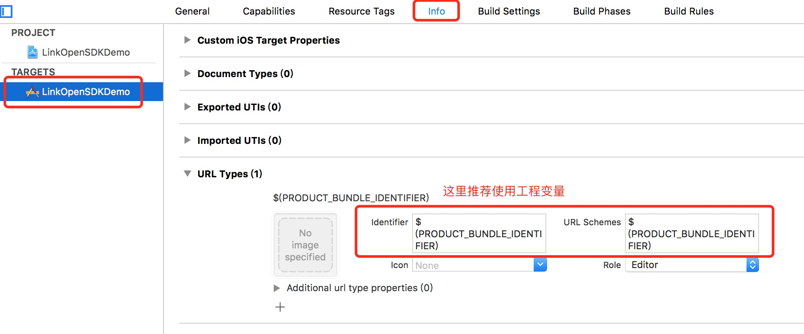

[](https://maven-badges.herokuapp.com/maven-central/net.bingosoft.oss/linksdk/badge.svg) [](https://www.apache.org/licenses/LICENSE-2.0.html)

# 品高聆客(Link)OpenSDK

为第三方iOS应用接入Link平台提供便捷的方式，默认读者已经熟悉IDE的基本使用方法（xCode），以及对Link平台有一定了解，并且已经申请了对应的 ClientId 和 ClientSecret 等。

## 安装

在XCode中新建工程，并在工程的Podfile里面添加以下代码：

```objc
pod 'LinkOpenSDK'
```

保存并执行`pod install`,然后用后缀为`.xcworkspace`的文件打开工程。如果无法正常安装，请先更新源`pod repo update`

[3] 配置URL scheme

在Xcode中，选择你的工程设置项，选中“TARGETS”一栏，在“info”标签栏的“URL type“添加“URL scheme”为你的应用程序的`Bundle Identifier`。也可以使用工程变量`$(PRODUCT_BUNDLE_IDENTIFIER)`代替。



或者直接打开Info.plist，进行如下修改：

```
<key>CFBundleURLTypes</key>
<array>
    <dict>
        <key>CFBundleURLName</key>
        <string>$(PRODUCT_BUNDLE_IDENTIFIER)</string>
        <key>CFBundleURLSchemes</key>
        <array>
            <string>$(PRODUCT_BUNDLE_IDENTIFIER)</string>
        </array>
    </dict>
</array>

<key>LSApplicationQueriesSchemes</key>
<array>
    <string>com.bingosoft.linkonline</string>
</array>
```
**注意事项**

iOS 应用间的跳转利用URL Scheme，同时得配置查询参数`LSApplicationQueriesSchemes`，这里假设需要跳转的Link的`Bundle Identifier`是`com.bingosoft.linkonline`


## 使用
[1] 在需要使用LinkOpenSDK的文件中引入头文件`LinkApi.h`

这里以`AppDelegate.h`为例，引入头文件并实现`LinkApiDelegate`协议，参考如下：

```objc
#import <LinkOpenSDK/LinkApi.h>
@interface AppDelegate : UIResponder <UIApplicationDelegate, LinkApiDelegate>
...
@end

```

[2] 注册到Link平台，在`AppDelegate.m` 的`didFinishLaunchingWithOptions` 函数中向Link注册ClientId。参考如下：

```objc
- (BOOL)application:(UIApplication *)application didFinishLaunchingWithOptions:(NSDictionary *)launchOptions {
	 //ClientId是当前应用申请下来的客户端Id
	 [LinkApi registerApp:@"ClientId"];
    return YES;
}
```

[3] 重写`AppDelegate.m`的`handleOpenURL`和`openURL`方法：

```objc
- (BOOL)application:(UIApplication *)application handleOpenURL:(NSURL *)url
{
    return  [LinkApi handleOpenURL:url delegate:self];
}

- (BOOL)application:(UIApplication *)application openURL:(NSURL *)url sourceApplication:(NSString *)sourceApplication annotation:(id)annotation
{
    return [LinkApi handleOpenURL:url delegate:self];
}
```

[4] 发送请求到Link终端
现在，你的程序想要发送请求到Link终端，可以通过`LinkApi`里面的`sendReq`方法来实现。

```objc
 [LinkApi sendReq:req];

```

sendReq是第三方app主动发送请求给Link终端，发送完成之后会切回到第三方app界面。

[5] 你的程序要实现和Link 终端交互的具体请求与回应，因此需要实现`LinkApiDelegate`协议的两个方法:

```objc
- (void) onReq:(BaseReq *)req {
   ...
}

- (void) onResp:(BaseResp *)resp {
	...
}

```

如果第三方程序向Link发送了`sendReq`的请求，那么`onResp`会被回调。`sendReq`请求调用后，会切到Link终端程序界面。


至此，你已经能使用`LinkOpenSDK`的API内容了。如果想要更详细了解每个API函数的用法，请下载源码，查看里面的示例。

更多接入场景：[开发者平台](http://dev.bingocc.com/guide/)